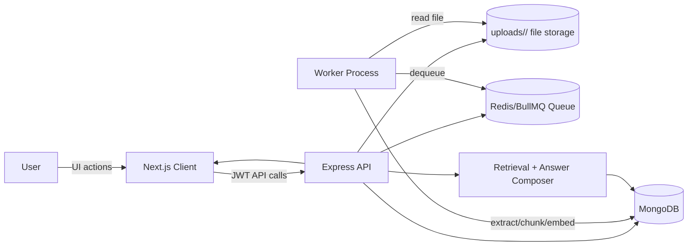
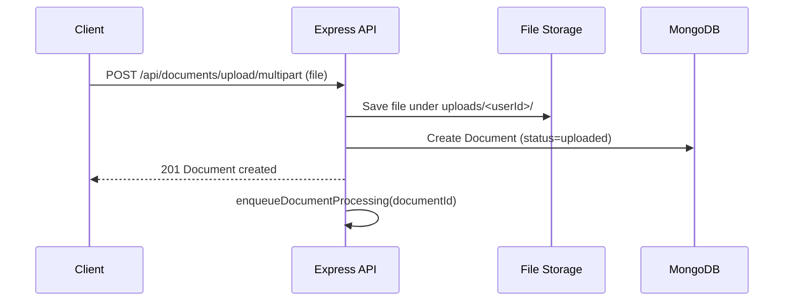
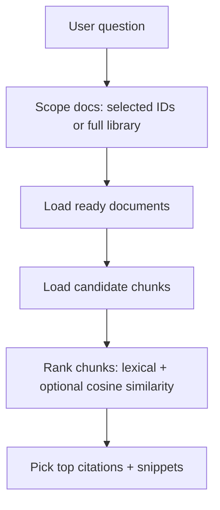

# DocuMind — Backend API

REST API for **DocuMind**: **JWT authentication**, **user-isolated** documents and chats, **async document ingestion** (extract → chunk → persist), and **retrieval-grounded** Q&A with citations. Intended for the Trao Full-Stack AI Engineering assessment.

**Pair with:** [documind-client](../documind-client). This service does not serve the SPA; configure CORS for your frontend origin.

---

## Stack

| Layer | Choice |
|--------|--------|
| Runtime | **Node.js** + **TypeScript** |
| HTTP | **Express 5** |
| Data | **MongoDB** via **Mongoose** |
| Auth | **JWT** (access + refresh), **bcrypt** password hashing |
| Ingestion | **pdf-parse**, **mammoth** (DOCX), **JSZip** + slide XML (PPTX); in-process **worker queue** with retries |
| AI | Optional OpenAI embeddings + grounded generation with safe fallback |

---

## High-Level Architecture (Backend)



---

## Architecture (modules)

```
src/
  server.ts              # HTTP server entry
  app.ts                 # Express app, CORS, JSON limits, error handler
  routes/index.ts        # Mount /api/auth, /api/documents, /api/chats
  modules/
    auth/                # register, login, refresh, me, profile
    user/                # User model
    document/            # CRUD, upload, ingestion/, chunk model, processing queue
    chat/                # chats, ask, suggestions, feedback
      rag/               # retrieval.service.ts, response-composer.ts
  utils/                 # API envelope, HTTP errors
uploads/                 # Per-user file storage: uploads/<userId>/...
```

- **Isolation:** Every query scopes by `userId` from the verified access token.
- **RAG (current):** Hybrid retrieval (lexical + optional embedding similarity). If `OPENAI_API_KEY` is not set, it automatically falls back to lexical-only ranking and template responses.

---

## End-to-End Backend Flow (User request → Answer)

### Document ingestion flow



### Processing pipeline

```mermaid
sequenceDiagram
  participant Q as Redis/BullMQ
  participant W as Worker
  participant FS as File Storage
  participant DB as MongoDB

  Q-->>W: Job(documentId)
  W->>DB: status=processing
  W->>FS: Read uploaded file bytes
  W->>W: Extract text (pdf/docx/pptx; ppt best-effort)
  W->>W: Chunk text
  W->>W: Optional embeddings (OPENAI_API_KEY)
  W->>DB: Upsert DocumentChunk[] (with optional embedding)
  W->>DB: status=ready (or failed)
```

### Retrieval flow



### Chat interaction flow

```mermaid
sequenceDiagram
  participant UI as Client
  participant API as Chat API
  participant DB as MongoDB

  UI->>API: POST /api/chats/ask (message, chatId?, documentIds?)
  API->>DB: Validate user + scope docs
  API->>DB: Retrieve ranked citations (chunks)
  API->>API: Compose answer (OpenAI if configured; fallback otherwise)
  API->>DB: Persist user+assistant messages (with citations)
  API-->>UI: assistantMessage + citations
```

---

## Prerequisites

- **Node.js** 20+
- **MongoDB** 6+ (Atlas or local)

---

## Setup

### 1. Install

```bash
npm install
```

### 2. Environment

Create **`.env`** in this directory:

```env
PORT=5000
MONGO_URI=mongodb://localhost:27017
MONGODB_DB_NAME=documind
JWT_SECRET=change-me-to-a-long-random-string
ACCESS_TOKEN_EXPIRY=15m
REFRESH_TOKEN_EXPIRY=7d
OPENAI_API_KEY=
OPENAI_CHAT_MODEL=gpt-4o-mini
OPENAI_EMBEDDING_MODEL=text-embedding-3-small
REDIS_URL=redis://127.0.0.1:6379
PROCESSOR_MODE=all
APP_BASE_URL=http://localhost:3000
SMTP_HOST=
SMTP_PORT=587
SMTP_USER=
SMTP_PASS=
EMAIL_FROM=noreply@documind.local
```

#### What each env var does (backend-oriented)

- **`MONGO_URI` / `MONGODB_DB_NAME`**: persists users, documents, chunks, chats (the system of record).
- **`JWT_SECRET` / `ACCESS_TOKEN_SECRET` / `REFRESH_TOKEN_SECRET`**: signs tokens so every request can be scoped to `userId`.
- **`REDIS_URL`**: queue backend for ingestion jobs (API enqueues; worker dequeues).
- **`PROCESSOR_MODE`**:
  - `all`: API + worker in one process (easy local dev)
  - `api`: only serve HTTP routes
  - `worker`: only run BullMQ worker loop
- **`OPENAI_*`**: optional embeddings + grounded generation. When unset, the app still works (lexical retrieval + fallback answers).
- **`APP_BASE_URL` + SMTP vars**: used to deliver verification/reset links by email (falls back to logging if SMTP is not configured).

Production: restrict **`cors()`** in `src/app.ts` to your Next.js origin instead of open CORS if you expose this API publicly.

### 3. Run (development)

```bash
npm run dev
```

API listens on `http://localhost:${PORT}` (default **5000**).

For split-process mode:

```bash
# terminal 1
npm run dev:api

# terminal 2
npm run dev:worker
```

### 4. Compile

```bash
npm run build
```

Runs `tsc`. Production entry: **`npm start`** → `node dist/server.js`.

---

## API overview

| Method | Path | Auth | Description |
|--------|------|------|-------------|
| POST | `/api/auth/register` | No | Sign up |
| POST | `/api/auth/login` | No | Sign in |
| POST | `/api/auth/refresh` | No | New access token |
| POST | `/api/auth/verification/request` | No | Request email verification link (logged in server) |
| POST | `/api/auth/verification/confirm` | No | Verify email using token |
| POST | `/api/auth/password/forgot` | No | Request password reset link (logged in server) |
| POST | `/api/auth/password/reset` | No | Reset password with token |
| GET | `/api/auth/me` | Yes | Current user |
| PUT | `/api/auth/profile` | Yes | Update name/email |
| POST | `/api/auth/account/delete` | Yes | Delete account (`password` in JSON body) |
| GET | `/api/documents/processing/health` | No | Queue/worker metrics |
| GET | `/api/documents` | Yes | List documents |
| POST | `/api/documents` | Yes | Create metadata (optional path) |
| POST | `/api/documents/upload` | Yes | Upload file (JSON body: base64 + metadata) |
| POST | `/api/documents/upload/multipart` | Yes | Upload file (`multipart/form-data`, field `file`) |
| DELETE | `/api/documents/:id` | Yes | Delete document + chunks |
| GET | `/api/chats` | Yes | List chats |
| GET | `/api/chats/suggestions` | Yes | Starter questions |
| GET | `/api/chats/:chatId` | Yes | Messages |
| POST | `/api/chats/ask` | Yes | Ask (retrieve + grounded reply + citations) |
| POST | `/api/chats/:chatId/messages/:messageId/feedback` | Yes | thumbs up/down |

Responses use a consistent envelope: `{ status, message, data, error }`.

---

## Document lifecycle

1. **Upload** — File saved under `uploads/<userId>/`, row `status: uploaded`.
2. **Worker** — Job dequeued from Redis/BullMQ → `processing` → extract text → chunk → optional per-chunk embeddings (if OpenAI key exists) → replace `DocumentChunk` rows → `ready` or `failed` (with retries).

---

## Security notes

- Passwords never stored plain text.
- Access token proves identity; all document/chat routes require it.
- Filenames sanitized; upload size limits enforced server-side.

---

## Deploying

1. Provision **MongoDB** (URI in `MONGO_URI`).
2. Set strong **`JWT_SECRET`** and token expiries.
3. Run API and worker as separate processes/containers against the same Redis for distributed processing.
4. Update CORS in `app.ts` so only your deployed Next.js origin can call the API.
5. Persist **`uploads/`** on disk or migrate to object storage for multi-instance setups.

---

## Limitations (honest)

- **.ppt** (legacy binary) uses a best-effort `soffice` conversion path when LibreOffice is available; otherwise it falls back to heuristic extraction.
- Embeddings and generated answers require `OPENAI_API_KEY`; without it, lexical retrieval + deterministic fallback responses are used.
- **Multipart** upload is available on `POST /api/documents/upload/multipart`; JSON base64 upload remains for API clients that prefer it.

---

## Scripts

| Command | Purpose |
|---------|---------|
| `npm run dev` | `ts-node-dev` / dev entry |
| `npm run dev:api` | API-only process |
| `npm run dev:worker` | Worker-only process |
| `npm run build` | `tsc` compile |
| `npm start` | Production start (see `package.json`) |
| `npm run test:e2e:smoke` | Curl-based smoke flow (register/upload/ask) |
| `npm run test:e2e:api` | Node assertion-based API auth/e2e checks |

---

## Full-system docs

See the **[repository root README](../README.md)** for end-to-end diagrams, assessment checklist, and narrative (if this repo is part of a monorepo).
