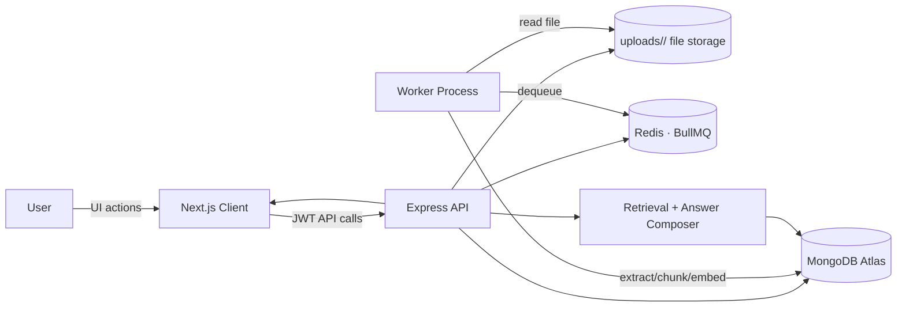
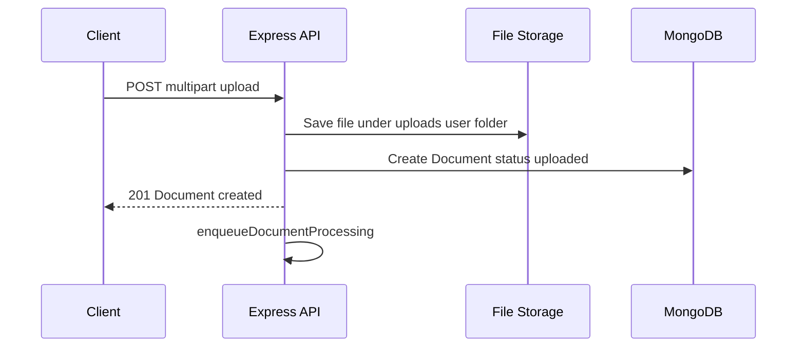
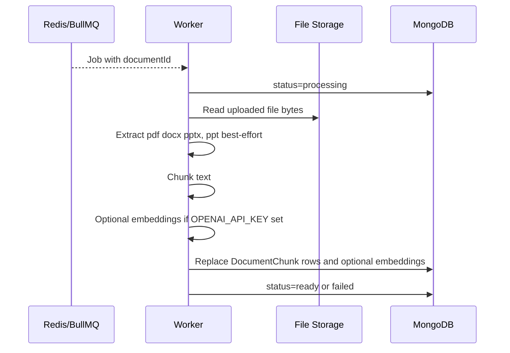
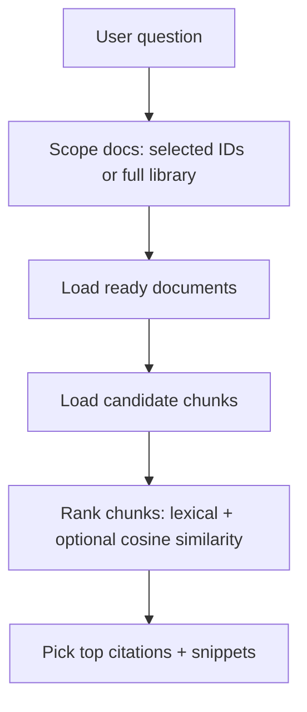
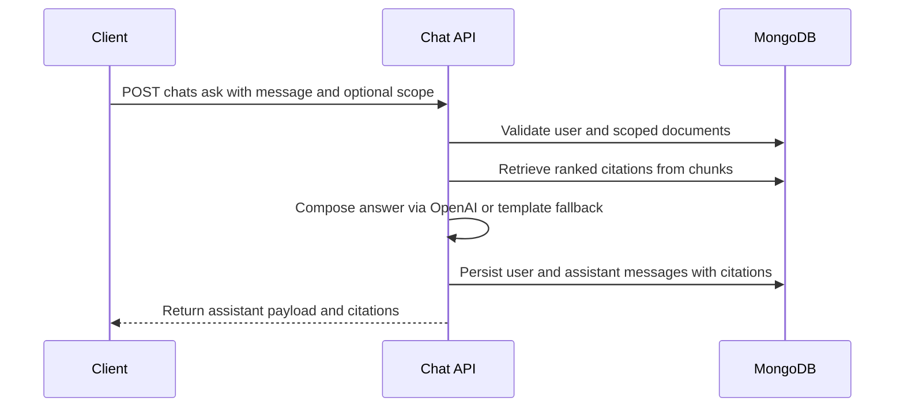

# DocuMind — Backend API

REST API for **DocuMind**: **JWT authentication**, **user-isolated** documents and chats, **async document ingestion** (extract → chunk → persist), and **retrieval-grounded** Q&A with citations. Intended for the Trao Full-Stack AI Engineering assessment.

**Pair with:** [documind-client](../documind-client). This service does not serve the SPA; configure CORS for your frontend origin.

### Live deployment (production)

| | URL |
|--|-----|
| **API** | [https://api.documind.enrolbee.com/](https://api.documind.enrolbee.com/) |
| **Web app** | [https://documind.enrolbee.com/](https://documind.enrolbee.com/) |

**Hosting (production):**

- **AWS:** Next.js frontend, Express API, BullMQ **worker**, **Redis** (job backend), and file upload storage.
- **MongoDB Atlas:** Managed database for users, documents, chunks, and chats (`MONGODB_URI` points at your Atlas cluster).
- **Asynchronous processing:** **BullMQ** queues on top of **Redis** — the API enqueues ingestion jobs; the worker consumes them so uploads are not processed on the HTTP thread.

The API root returns a JSON health-style payload. Ensure **`CORS_ORIGINS`** on the server includes **`https://documind.enrolbee.com`** (no trailing slash). The frontend should set **`NEXT_PUBLIC_API_URL=https://api.documind.enrolbee.com`** (no trailing slash).

---

## Project overview

This backend exposes a clean REST surface for:

- **User authentication** with refresh tokens and strict user isolation.
- **Document ingestion**: upload → persist → enqueue → background processing.
- **Processing pipeline**: extract text → chunk → (optional) embed → persist chunks.
- **Retrieval + grounded Q&A** for chat: rank chunks, attach citations, generate an answer (optional OpenAI) or return a safe fallback.

---

## Chosen tech stack (and why)

| Layer | Choice |
|--------|--------|
| Runtime | **Node.js** + **TypeScript** |
| HTTP | **Express 5** |
| Data | **MongoDB** via **Mongoose** |
| Auth | **JWT** (access + refresh), **bcrypt** password hashing |
| Ingestion | **pdf-parse**, **mammoth** (DOCX), **JSZip** + slide XML (PPTX) |
| Queue/worker | **Redis + BullMQ** (split API/worker modes for production-like architecture) |
| AI | Optional OpenAI embeddings + grounded generation with safe fallback |

Why these choices:

- **Express + TS**: fast iteration, explicit request validation patterns, simple deployment.
- **MongoDB**: flexible schema for chat messages + citations and chunk storage; easy user scoping.
- **BullMQ/Redis**: makes ingestion truly async and scalable beyond a single node process.
- **OpenAI optionality**: the system works offline (lexical retrieval + fallback), but can upgrade to semantic retrieval + generated grounded answers when configured.

---

## High-Level Architecture (Backend)



---

## Architecture (modules)

```
src/
  server.ts              # HTTP server entry
  app.ts                 # Express app, CORS, JSON limits, error handler
  routes/index.ts        # Mount /api/auth, /api/documents, /api/chats
  modules/
    auth/                # register, login, refresh, me, profile
    user/                # User model
    document/            # CRUD, upload, ingestion/, chunk model, processing queue
    chat/                # chats, ask, suggestions, feedback
      rag/               # retrieval.service.ts, response-composer.ts
  utils/                 # API envelope, HTTP errors
uploads/                 # Per-user file storage: uploads/<userId>/...
```

- **Isolation:** Every query scopes by `userId` from the verified access token.
- **RAG (current):** Hybrid retrieval (lexical + optional embedding similarity). If `OPENAI_API_KEY` is not set, it automatically falls back to lexical-only ranking and template responses.

---

## End-to-End Backend Flow (User request → Answer)

### Document ingestion flow



### Processing pipeline



### Retrieval flow



### Chat interaction flow



---

## Prerequisites

- **Node.js** 20+
- **MongoDB** 6+ (Atlas or local)
- **Redis** (for BullMQ queue)

---

## Setup

### 1. Install

```bash
npm install
```

### 2. Environment

Create **`.env`** in this directory:

```env
PORT=5000
MONGODB_URI=mongodb://localhost:27017
MONGODB_DB_NAME=documind
ACCESS_TOKEN_SECRET=change-me-access-secret-long-random
REFRESH_TOKEN_SECRET=change-me-refresh-secret-different-long-random
ACCESS_TOKEN_EXPIRY=15m
REFRESH_TOKEN_EXPIRY=7d
OPENAI_API_KEY=
OPENAI_CHAT_MODEL=gpt-4o-mini
OPENAI_EMBEDDING_MODEL=text-embedding-3-small
REDIS_URL=redis://127.0.0.1:6379
PROCESSOR_MODE=all
CORS_ORIGINS=http://localhost:3000
```

#### What each env var does (backend-oriented)

- **`MONGODB_URI` / `MONGODB_DB_NAME`**: required; persists users, documents, chunks, chats (the system of record).
- **`ACCESS_TOKEN_SECRET` / `REFRESH_TOKEN_SECRET`**: required, **must differ**; signs access vs refresh tokens (`JWT_SECRET` is not used).
- **`REDIS_URL`**: queue backend for ingestion jobs (API enqueues; worker dequeues).
- **`PROCESSOR_MODE`**:
  - `all`: API + worker in one process (easy local dev)
  - `api`: only serve HTTP routes
  - `worker`: only run BullMQ worker loop
- **`OPENAI_*`**: optional embeddings + grounded generation. When unset, the app still works (lexical retrieval + fallback answers).
- **`CORS_ORIGINS`**: comma-separated allowed browser origins (see `src/app.ts`).

Production: set **`CORS_ORIGINS`** to your deployed Next.js origin when you expose this API publicly.

### 3. Run (development)

```bash
npm run dev
```

API listens on `http://localhost:${PORT}` (default **5000**).

For split-process mode:

```bash
# terminal 1
npm run dev:api

# terminal 2
npm run dev:worker
```

### 4. Compile

```bash
npm run build
```

Runs `tsc`. Production entry: **`npm start`** → `node dist/server.js`.

---

## Setup (deployed)

**DocuMind production** uses **AWS** for app/worker/Redis/storage and **MongoDB Atlas** for the database (see [Live deployment (production)](#live-deployment-production)). The checklist below applies to that environment and to any self-hosted copy of the architecture.

Minimum production-style deployment has **three** moving parts:

- **API service**: runs HTTP routes (`PROCESSOR_MODE=api`)
- **Worker service**: runs the **BullMQ** ingestion worker (`PROCESSOR_MODE=worker`)
- **MongoDB Atlas** + **Redis**: Atlas for persistence; Redis as the BullMQ broker/backing store for the document-processing queue

Deployment checklist:

- Configure **MongoDB Atlas** (`MONGODB_URI`, `MONGODB_DB_NAME`) — cluster connection string from Atlas.
- Configure **Redis** (`REDIS_URL`) for **BullMQ** (same Redis URL for API enqueue and worker).
- Configure **`ACCESS_TOKEN_SECRET`** and **`REFRESH_TOKEN_SECRET`** (different values).
- Set **`CORS_ORIGINS`** to your deployed frontend origin.
- Ensure `uploads/` is **persistent storage** (disk volume) or migrate to object storage if running multiple instances.

---

## API overview

| Method | Path | Auth | Description |
|--------|------|------|-------------|
| POST | `/api/auth/register` | No | Sign up |
| POST | `/api/auth/login` | No | Sign in |
| POST | `/api/auth/refresh` | No | New access token |
| GET | `/api/auth/me` | Yes | Current user |
| PUT | `/api/auth/profile` | Yes | Update name/email |
| POST | `/api/auth/account/delete` | Yes | Delete account (`password` in JSON body) |
| GET | `/api/documents/processing/health` | No | Queue/worker metrics |
| GET | `/api/documents` | Yes | List documents |
| POST | `/api/documents` | Yes | Create metadata (optional path) |
| POST | `/api/documents/upload` | Yes | Upload file (JSON body: base64 + metadata) |
| POST | `/api/documents/upload/multipart` | Yes | Upload file (`multipart/form-data`, field `file`) |
| DELETE | `/api/documents/:id` | Yes | Delete document row, all its chunks, and the file under `uploads/` (path-jailed) |
| GET | `/api/chats` | Yes | List chats |
| GET | `/api/chats/suggestions` | Yes | Starter questions |
| GET | `/api/chats/:chatId` | Yes | Messages |
| POST | `/api/chats/ask` | Yes | Ask (retrieve + grounded reply + citations) |
| POST | `/api/chats/:chatId/messages/:messageId/feedback` | Yes | thumbs up/down |

Responses use a consistent envelope: `{ status, message, data, error }`.

---

## Authentication and authorization approach

- **Register** creates a user, hashes password, and issues access+refresh tokens.
- **Access token**: sent as `Authorization: Bearer <token>`; middleware attaches `req.user.userId`.
- **Refresh token**: used by the frontend to refresh access on `401`.
- **Authorization**: every document, chunk, and chat query filters by `userId` (hard multi-tenant isolation).

---

## AI agent design and purpose

The “agent” here is a **grounded document QA assistant**:

- **Purpose**: answer user questions using **only evidence from the user’s uploaded documents** and return **citations**.
- **Retrieval**: hybrid scoring (lexical overlap + optional cosine similarity if embeddings exist).
- **Generation**: if `OPENAI_API_KEY` is configured, a short grounded answer is generated from retrieved snippets; otherwise a deterministic fallback response is returned.
- **Safety**: when no evidence is found, the assistant explicitly says it does not have enough information.

---

## Creative/custom features

- **Message feedback loop**: thumbs up/down persisted per assistant message (`/api/chats/.../feedback`).
- **Starter question generation**: `/api/chats/suggestions` based on doc names + snippets + prior questions.
- **Processing transparency**: `/api/documents/processing/health` exposes queue/worker metrics for a better UX.

---

## Key design decisions and trade-offs

- **JSON base64 upload kept** alongside multipart:
  - **Pro**: easy for API clients
  - **Con**: higher memory overhead than streaming
- **BullMQ**:
  - **Pro**: scalable, split worker from API
  - **Con**: requires Redis
- **Optional OpenAI**:
  - **Pro**: semantic retrieval + better answers when available
  - **Con**: requires external API + keys; must handle failures gracefully

---

## Document lifecycle

1. **Upload** — Multipart or JSON base64: file written to `uploads/<userId>/{documentId}-{sanitizedFileName}`, `storagePath` stored on the document, row `status: uploaded`, then **`enqueueDocumentProcessing`** runs (BullMQ job id = document id, retries with backoff).
2. **Worker** — Job dequeued → `processing` → read file from `storagePath` → extract text → chunk → optional embeddings when `OPENAI_API_KEY` is set → delete prior chunks for that document → insert new `DocumentChunk` rows → `ready`, or `failed` after retries.

### Deletion (`DELETE /api/documents/:documentId`)

Scoped to the authenticated user:

- Removes the **Document** document from MongoDB.
- **`deleteMany`** on **DocumentChunk** for that `documentId` (and `userId`).
- **Unlinks the file** on disk when `storagePath` is set and **`resolvePathInsideUploads`** confirms it stays under the `uploads/` root (traversal-safe).

**Not** cleared by this handler (by design today): **chat transcripts** (old messages can still show citations to the deleted file name/id), **`ChatResponseCache`** rows (an identical question + scope may still hit a cached answer until the cache entry is stale or the query scope changes). Deleting while `status` is **`processing`** can race with the worker (e.g. missing file on read, or rare inconsistency); prefer waiting for `ready` / `failed` before delete in production UX.

---

## Security notes

- Passwords never stored plain text.
- Access token proves identity; all document/chat routes require it.
- Filenames sanitized; upload size limits enforced server-side.

---

## Deploying

For the **public DocuMind instance**, the frontend and API/worker run on **AWS**, with **MongoDB Atlas** and **Redis** for **BullMQ** (see live URLs at the top of this README).

To deploy your own instance:

1. Provision **MongoDB Atlas** (or another MongoDB deployment) and set `MONGODB_URI` / `MONGODB_DB_NAME`.
2. Set strong, distinct **`ACCESS_TOKEN_SECRET`** and **`REFRESH_TOKEN_SECRET`** and token expiries.
3. Run **Redis** and point **`REDIS_URL`** at it; run API and worker as separate processes so both use the **same** Redis for **BullMQ**.
4. Set **`CORS_ORIGINS`** so only your deployed Next.js origin can call the API.
5. Persist **`uploads/`** on disk or migrate to object storage for multi-instance setups.

---

## Limitations (honest)

- **.ppt** (legacy binary) uses a best-effort `soffice` conversion path when LibreOffice is available; otherwise it falls back to heuristic extraction.
- Embeddings and generated answers require `OPENAI_API_KEY`; without it, lexical retrieval + deterministic fallback responses are used.
- **Multipart** upload is available on `POST /api/documents/upload/multipart`; JSON base64 upload remains for API clients that prefer it.

---

## Improvements (future)

- **Email verification**: optional SMTP-backed flow to verify new users before login, if product requirements change.

---

## Scripts

| Command | Purpose |
|---------|---------|
| `npm run dev` | `ts-node-dev` / dev entry |
| `npm run dev:api` | API-only process |
| `npm run dev:worker` | Worker-only process |
| `npm run build` | `tsc` compile |
| `npm start` | Production start (see `package.json`) |
| `npm run test:e2e:smoke` | Curl-based smoke flow (register/upload/ask) |
| `npm run test:e2e:api` | Node assertion-based API auth/e2e checks |

---

## Full-system docs

See the **[repository root README](../README.md)** for end-to-end diagrams, assessment checklist, and narrative (if this repo is part of a monorepo).
